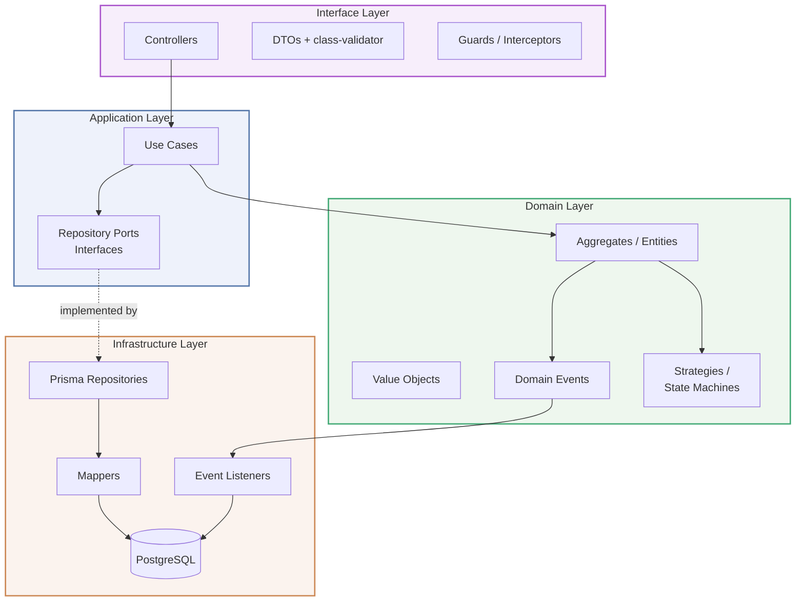
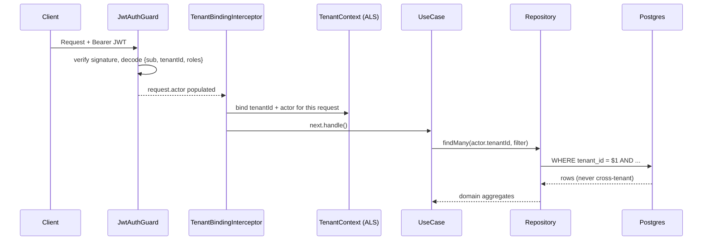
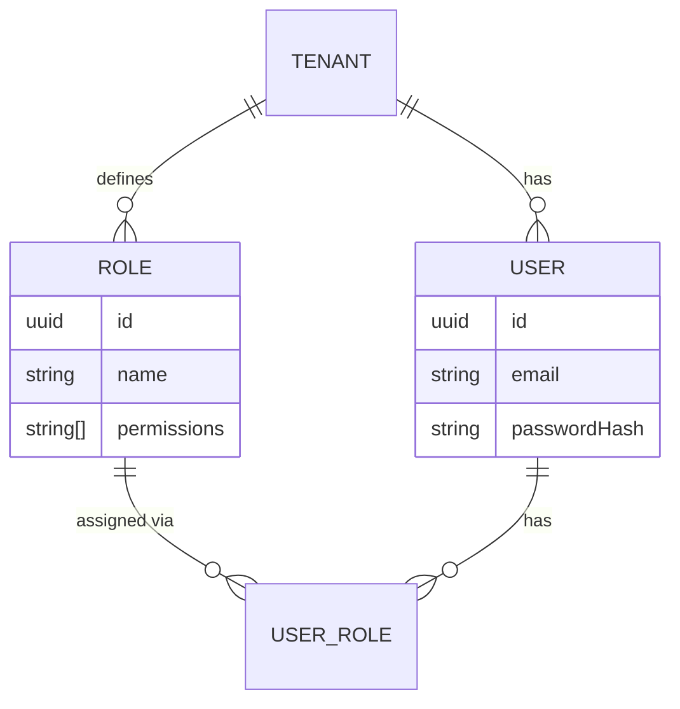
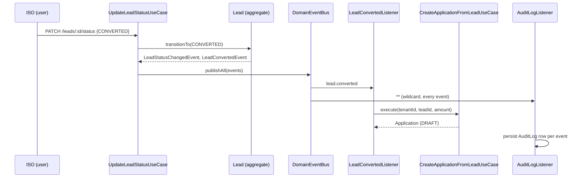
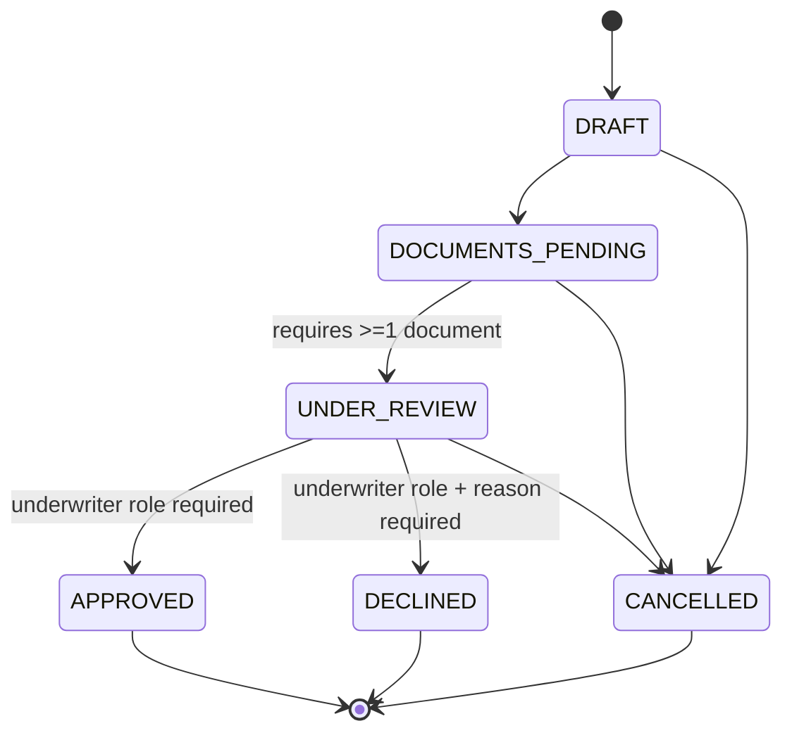

# Architecture

This service is organized as **Clean Architecture** with **Domain-Driven
Design** tactical patterns, implemented in **NestJS**. Every feature module
(`leads`, `applications`, `auth`, ...) is sliced into the same four layers,
and dependencies only ever point **inward**.

**Dependency rule:** `Domain` has zero knowledge of NestJS, Prisma, or HTTP.
`Application` depends only on `Domain` and on repository *ports*
(interfaces) — never on concrete Prisma classes. `Infrastructure` is the
only layer allowed to import Prisma or Express types. This is what makes
the domain layer unit-testable with zero mocking (see `test/unit`) and
what would let the persistence technology be swapped without touching a
single use case.

---

## Multi-tenancy

Row-level isolation, enforced in three independent layers (defense in depth
— any one of these failing shouldn't leak cross-tenant data):

1. **JWT claims** carry `tenantId` — issued once at login, scoped to a
   single tenant per token (a user belonging to two tenants gets two
   distinct tokens).
2. **AsyncLocalStorage** (`TenantContextService`, via `nestjs-cls`) carries
   the tenant through the whole async call chain without threading it
   through every function signature.
3. **Explicit repository filtering** — every Prisma query in every
   repository is written with `tenantId` in its `WHERE` clause. This is
   intentionally *not* hidden behind implicit middleware alone; explicit
   filtering keeps queries auditable in code review.

---

## RBAC (Role-Based Access Control)

Two complementary guard layers run globally (`APP_GUARD`), in this order:

1. `JwtAuthGuard` — authenticates (skipped for `@Public()` routes).
2. `RolesGuard` — checks coarse role membership (`@Roles('TENANT_ADMIN')`).
3. `PermissionsGuard` — checks fine-grained permission strings
   (`@RequirePermissions('application:decide')`), with `"*"` as an
   admin wildcard.

A role's `permissions: string[]` is data, not code — new permissions can be
granted to a role without a deploy.

---

## Event-driven workflow

The **Leads** and **Applications** bounded contexts do not import each
other. They communicate exclusively through domain events published on an
in-process event bus (`DomainEventBus`, backed by `@nestjs/event-emitter`),
following the **Observer pattern**.

Why this matters for the design: adding a *new* side effect to "lead
converted" (e.g. sending a welcome email) means adding a new
`@OnEvent('lead.converted')` listener — zero changes to `Lead`,
`UpdateLeadStatusUseCase`, or any existing listener (Open/Closed
Principle).

---

## Application (deal) workflow: state machine + strategy pattern

The *graph* of legal transitions (`APPLICATION_TRANSITIONS`) is separated
from the *business precondition* for entering a given status
(`TransitionStrategyRegistry`). Two independent axes, two independent
places to change them — see
`src/modules/applications/domain/strategies/transition-strategies.ts`.

---

## Design patterns used (index)

| Pattern | Where | Why |
|---|---|---|
| Repository | `*.repository.port.ts` / `prisma-*.repository.ts` | Decouples use cases from Prisma; enables in-memory fakes in unit tests |
| Strategy | `applications/domain/strategies` | Per-transition business rule validation, added without touching the aggregate |
| Observer | `DomainEventBus`, `@OnEvent` listeners | Cross-module side effects (audit log, lead→application handoff) without coupling |
| Factory | `CreateApplicationFromLeadUseCase`, `TransitionStrategyRegistry.resolve` | Encapsulates object construction rules |
| State Machine | `LEAD_TRANSITIONS`, `APPLICATION_TRANSITIONS` | Explicit, declarative lifecycle graphs instead of scattered `if` statements |
| Mapper / Anti-Corruption Layer | `lead.mapper.ts`, `application.mapper.ts` | Isolates the domain model from the Prisma persistence shape |
| Result object | `shared/domain/result.ts` | Expected business failures are values, not exceptions — keeps control flow explicit |
| Dependency Inversion | Every `application/ports/*.port.ts` | Application layer depends on abstractions, injected via NestJS DI tokens |
| Decorator | `@Public()`, `@Roles()`, `@RequirePermissions()`, `@CurrentUser()` | Declarative, composable cross-cutting metadata on routes |
| Aggregate Root / Entity / Value Object | `shared/domain/*` | DDD tactical building blocks with identity vs. structural equality |

---

## What was intentionally left out (vs. the original MCA platform)

This is a **portfolio** build. The proprietary business logic of the
production MCA CRM — underwriting decision rules, commission/syndication
math, ACTUM repayment integration, funding disbursement mechanics — is
**not** reproduced here. What's demonstrated instead is the *engineering
substrate* that any such system needs: multi-tenancy, RBAC, a clean
event-driven workflow engine, and a persistence/domain separation that
would let real business rules be dropped in behind the same seams
(`TransitionStrategyRegistry` is exactly where they'd go).
